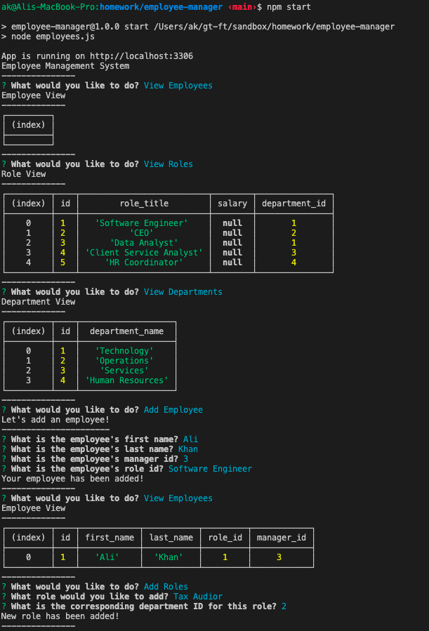

# Employee Management System

## Description

A command-line application that allows the user to manage their employees. The user can add employees, add roles, add departments, view employees, view roles, and view departments from the command line.

## Table of Contents

- Installation
- Usage
- License
- Contributors
- Tests
- Questions

## Installation

Download the repository from my GitHub page here: https://github.com/icecicle04/employee-manager

## Usage

In order to keep track of your employee's, roles, and departments.

## Licenses

MIT

## Contributors

Ali Khan

## Tests

Tested on local machine

## Questions

email Ali @ icecicle04@gmail.com

